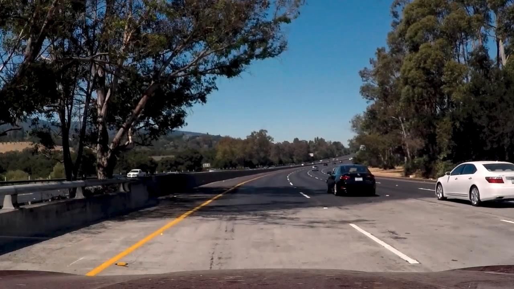
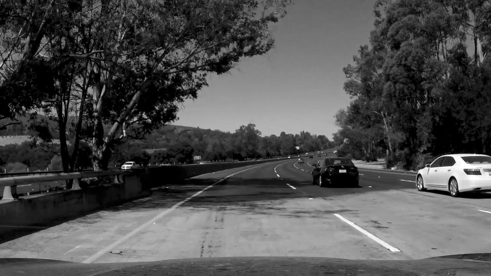
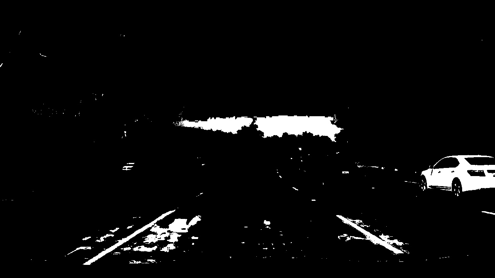
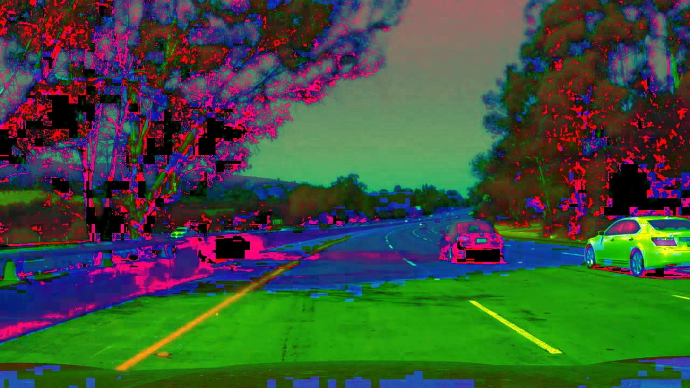
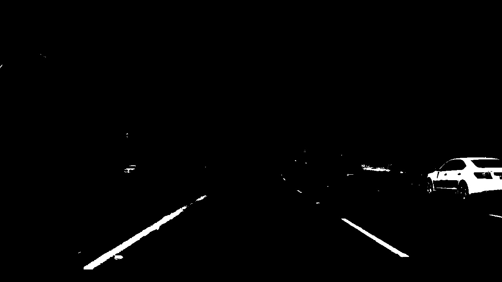
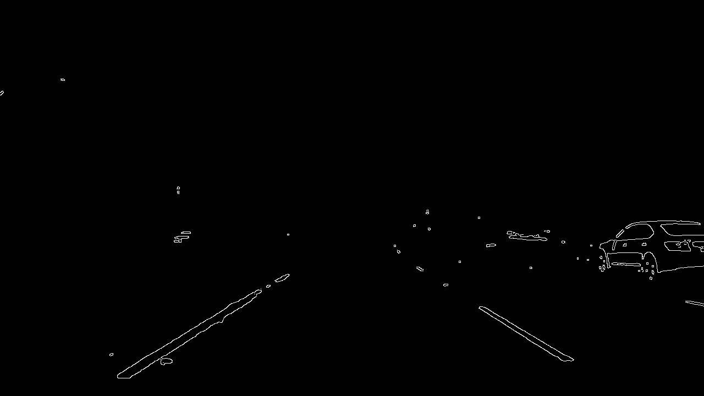
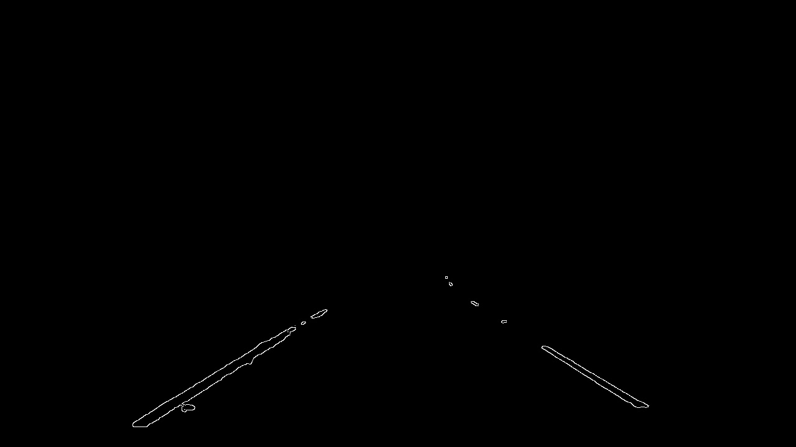
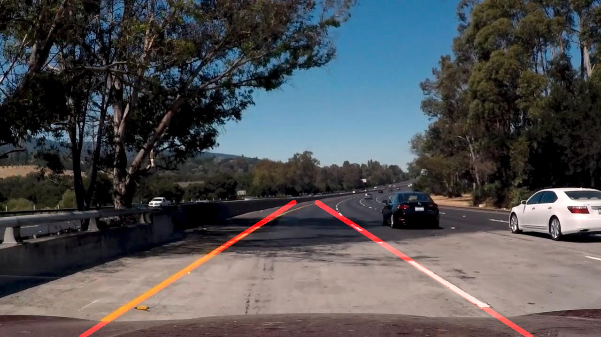

# **Finding Lane Lines on the Road** 

**Finding Lane Lines on the Road**

The goals / steps of this project are the following:

* Make a pipeline that finds lane lines on the road
* Reflect on your work in a written report

---

## Reflection

---

### 1. Display and Write images helper functions
I defined two new helper functions for the exercise:
1. `display` which displays the images on a given image list `imlist`. This will help during testing of each subsequent step of the pipeline applied to all input images. 
2. `write` which writes the images from the given `imlist` to the `output_path` by combining the given names from the `imname_list` with a predefined `suffix`.

---

### 2. Load and display test images
I read all the images from the given path and then use the helper function created above to display them. During the implementation of the exercise when I reached the last **challenge** video I had problems detecting the lanes. This was caused by: 
1. The different resolution compared to the rest of the photos and videos
2. Because of the particular conditions on the challenge video (shades, tarmac difference, steepness of curves)

On my later iterations on the exercise, to have a feeling how my pipeline is handling the last video, I took also two screenshots from the **challenge** video during the testing phase. I tried to take two screenshots that represent the most tricky situations on detection.
As an example on the report I will use a frame taken from that video:

---

### 3. Identifying the lane line detection pipeline

---

#### Step 1: Changing colorspace to Grayscale 

The images contain two different colors of lines **white** and **yellow**. In order to proceed to a color selection I decided initially to convert the images to grayscale color space suspecting that the **yellow** color will be leaning towards the **white** so I can extract afterwards by selecting only one color threshold.

---

#### Step 2: Selecting color(s)

It seemed that also the **yellow** lines came closer to the **white** color, which I wanted to get from the image. I tried color selection using appropriate thresholds for the *white* color to extract only the lines.

---

#### Step 4: Evaluating the result

At first glance the implication of this filtering was that, on the *easy* images the result was good. But I had some trouble identifying the lanes on the *challenging* images. On my first exercise iteration I continued until the end and found out that using this color space and color selection can produce decent results on the first two videos.

The problem arouse when I tried to run my pipeline on the **challenge** video though. The pipeline was unable to identify a satifsying number of lines because the edges were obscure. I realised that in order to make it work I had to do something different.

---

#### Step 5: Changing colorspace to HLS

With a little bit of internet research I learnt about another colorspace which can be useful on this situation. The [HSL or HLS](https://en.wikipedia.org/wiki/HSL_and_HSV). It was a common practice also for detecting different color lines in other projects so it was worth a try.

[OpenCV](http://docs.opencv.org/3.1.0/de/d25/imgproc_color_conversions.html) seems to already provide the functionality by just changing the attribute of the `cvtColor` to `cv2.COLOR_RGB2HLS`

The result as it can be seen below is indeed better because both the **white** and the **yellow** lines are pretty clear and can be extracted.

---

#### Step 6: Selecting color(s) (part 2)

After a little bit of research about the coordinates of **HLS** (`Hue`,`Light` and `Saturation`) and the tool provided in [this](http://colorizer.org/) website I picked the required color levels for my color selection. The optimization of the selection required a little bit of trial and error.

The results were much better than the previous color selection I had above.

---

#### Step 7: Blurring the image

For the next step I used the `gaussian_blur` function as I wanted to make the image smoother for the edge detection coming next. Keeping in mind that:

* The kernel size shall be a positive odd number `(1,2,3,...,2k+1)`. 

---

#### Step 8: Detecting Edges

As it was taught in class I applied the Canny function of [OpenCV](http://docs.opencv.org/3.0-beta/doc/tutorials/imgproc/imgtrans/canny_detector/canny_detector.html). Also keeping in mind:

* The threshold ratio for the Canny edge detection algorithm shall be an `1:2` to `1:3` `low_threshold` vs `high threshold`.

---

#### Step 9: Masking the lane line area

Next step was to apply a region of interest. It made things easier by getting rid of unecessary information which would later mess line detection. At fist I used one array of `vertices` for all images. I realised that was a **bad** idea as the `challenge` video reminded me that not all the videos and images have the same **resolution**. 

So I refurbished a little bit my code by implementing a function which given the input image `img`
defines vertices proportional to the size of `x` and `y` of the image. This takes for granted that the camera on the car is mounted on the *"same"* spot. Nevertheless it was helpful for the videos provided.

---

#### Step 10: Detecting the lines

After that Hough lines transformation algorithm followed. Using the [OpenCV](http://docs.opencv.org/3.0-beta/doc/tutorials/imgproc/imgtrans/hough_lines/hough_lines.html) probabilistic function. The most tricky part was to find a good parameter set to satisfy all the given frames. I had to optimize the parameters once more when I was processing the videos later.

At this point  I also saved the results as new images with the suffix **`raw`**  on my `test_images_output` folder.

---

#### Step 11: Averaging and extrapolating for the final lane lines

In order to get similar result as the example given I had to average the sum of the hough lines and then extrapolate the average line based on a given point of the image that made sense defined by the `y` coordinate which is the same as the `y` of the top vertices of the **ROI**.

**In order to average the hough lines I made the following assumptions:**

1. According to the hint in order to separate the right lane from the left lane I took into account the `slope`.

	* If the `slope` is negative then the hough line is belonging to the left lane line because the `y` axis is actually reversed in the images. 
	* On the other hand if the `slope` is positive then it belongs to the right lane line.
   
2. Not all `hough lines` worth the same so I had somehow to put an extra coefficient like weight to take into account the slopes and intercepts of the lines which are more important. The thought was the **longer** the line the more important it should be. So I actually multiplied the line characteristics (`slope` and `intercept`) with the line `length`. Then for the *average* lanes I divided by the total sum of the lengths.

3. When I started video processing one extra *filtering* occured to me reading [this](https://medium.com/@esmat.anis/robust-extrapolation-of-lines-in-video-using-linear-hough-transform-edd39d642ddf). So I added in my averaging function the ability - giving as input the slopes of the lanes of the previous frame and a `tolerance`- to discard **hough lines** which didn't conform to the condition: `abs(slope - avg_slope) < tolerance`. That way I got rid of some jittering of the lanes on my videos occuring because of extreme slopes.

Then I defined a helper function which given the `y1` `y2` coordinates for the line points and the `lane_line` produces the end points of the **extrapolated** line.

---

#### Step 12: Drawing the lane lines on the image

Two more helper functions for the pipeline:

1. `lane_lines` gets the image and the hough lines for both lane lines and creates one single line for each side - *left* and *right* - by averaging and extrapolation.

2. `draw_lane` gets the `image` and the `lane_lines` and returns a new image with the lines on top of it.

By calling them I was able to reach the final result as it was displayed in the example and save the images to the `test_images_output` folder with the suffix `final`

---

### Long story short...

... the final pipeline consists of the following **8** steps:

1. Get the image.
2. Change the colorspace to HLS.
3. Apply color selection for the two colors of interest (**white** and **yellow**).
4. Blur the image by applying **gaussian** blurring function.
5. Detect the edges by using the **Canny** algorithm function.
6. Apply the **ROI** mask.
7. Apply **Hough** line transformation and retrieve the lines.
8. Draw the lines on the image using averaging and extrapolation.

---

### Then the videos came...

On first iteration on the exercise the pipeline worked on the detection but the output on the video was quite noisy.
I had to perform a solution which would grant a smoother line detection across the frames as in the example video. 

Thanks again to this [link](https://medium.com/@esmat.anis/robust-extrapolation-of-lines-in-video-using-linear-hough-transform-edd39d642ddf) I came up with a solution of both averaging the lane lines across the frames and filtering the Hough lines taking into account a tolerance on the difference between the Hough line slope with the average slope coming from the previous frame.

I needed information from the previous frames so a class implementation including also the given template of the `process_image` function would serve me well to track history of the `lane_lines` of the previous frame. The class apart from the `process_image` implements another two helper functions:

* `avg_lane_line` which performs the averaging of the lane lines across the frames using a simple implementation of a SMA with a moving window defined by the `frames_cnt` variable.

* `avg_slopes` which gets the final averaged lane lines and calculates the slope. This is needed by `process_image` in order to save the slopes in the class variables and use them as a reference to filter out the extreme hough lines of the next frame. 

---

## Conclusion

The exercise was very engaging for me. Reaching an outcome was really comfortable with the notes taken from the lesson. However, in order to reach the extra mile and complete the *challenge* video required some additional effort and research. This was the most exciting part of the exercise as it unveiled to me several potentials for improvement. Also it was a nice introduction to some libraries like OpenCV and NumPy which I didn't have the chance so far to use to such extent. I believe the result, though not optimal, reached an acceptable level. There is always room for improvement.

---

## Potential shortcomings

As potential shortcoming of my pipeline I identify the use of many parameters which are static and cannot be adjusted during runtime. This could cause issued if the pipeline is tried to other videos. Some examples:

* **Color of the lines:** The algorithm at that point can handle only white and yellow lines.

* **Region of interest:** The algorithm is only working for certain camera mounting and certain situations like straight road. Uphills and downhills may reduce the ability to detect.

Also the pipeline is sensitive to changes of environment such as low light conditions (night).

The algorithm so far cannot handle curves. Especially if they are steep enough could cause issues to the detection.

---

## Possible improvements 

For the static parameters we can introduce smart ways to tackle with some problems. For example:

* We could detect the different colors by applying different filters and masking techniques on runtime.
* To tackle the problem with the **ROI** we could also use information from previous lanes maximum point of Hough Lines in order and use it as an input for the next frame

One idea would be also to normalise the perspective of the frames and then apply the line detection pipeline. This would help with different camera mounting positions and different angles on x and y axis of the road.

We could also improve the averaging technique of the lines by using different techniques which perform on dynamics and on steady state (e.g. *adaptive filter*).